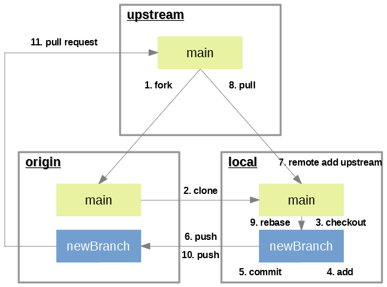

# Travailler GitHub

Ce service est un incontournable du développement sous HA. Il a pour vocation non seulement de gérer la vie d'un développement (source, version), mais également et surtout de pouvoir fédérer des développeurs sous un même projet, et ce sans cacophonie générale.

Pour vous aider à vous familiariser avec GitHub, vous pouvez consulter ce [petit guide](https://rogerdudler.github.io/git-guide/index.fr.html) qui présente les bases (et un peu plus).

Ne soyez pas effrayé par la manipulation en ligne de commande, vous verrez que vous pourrez vous en affranchir dans un outil de bureau (mais les bases sont à connaître!!!).

Voyons quand même quelques concepts indispensables..

## Les outils

Voici quelques outils :

- [git](https://git-scm.com/) est l'outil minimal à installer pour gérer avec Github.
- [Git Desktop](https://desktop.github.com/) ou [Git Kraken](https://www.gitkraken.com/) va s'ajouter à `git` avec une application graphique vous simplifiant la vie.
- [VSCode](https://code.visualstudio.com/) avec ses différents composants de gestion Git, mais pas aussi poussé que les 2 clients précédents.

## Méthodologie

- Vous voulez soumettre un bug ou faire une demande d'évolution, dans ce cas il vous faut soumettre une `issue` sur le dépôt principal.

- Vous voulez contribuer au développement (correction de bug, ajout de fonctionnalité), il vous faut alors suivre ces étapes :

  1. Le `Fork`, qui est la copie de la branche principale du dépôt du projet sur votre dépôt personnel GitHub.

  1. Le `Clone`, qui est la copie locale (sur votre PC) de votre dépôt GitHub.

  1. Créer une branche de développement, qui est une branche sur votre dépôt et propre à vos modifications.

  1. Les `Commit`, qui sont les différentes modifications que vous apportez. _Ces commits doivent être le plus spécialisé possible, c'est-à-dire traiter une seule modification et non une dizaine_.

  1. La `Pull Request`, qui sera la demande d'intégration de vos modifications auprès de la branche principale.

  1. La `Review`, qui sera la révision de vos modifications par l'équipe de développement du projet. Elle peut être amenée à vous demander des modifications, refuser certaines parties, etc

  1. Le `Merge`, qui est la dernière étape et concerne l'intégration définitive de votre `Pull Request` au projet. Cette dernière étape sera du ressort de l'équipe du projet.

## Les dépôts

Les dépôts sont des espaces de stockage spécifiques à un projet. Ce terme n'est pas spécifique à GitHub, vous le retrouverez pour Docker, Maven, etc

En ce qui concerne GitHub, un dépôt est associé à un profil utilisateur ou d'organisation et son adresse sera `https://github.com/`_`profil`_`/`_`projet`_

Vous pouvez avoir plusieurs dépôts de référencés dans votre copie locale. Généralement, le 1er dépôt que vous clonerez sera nommé `origin` et sera lié à votre dépôt personnel. Vous ajouterez le dépôt principale du projet, le `upstream`, ce qui permettra de visionner les différences, remettre à jour votre base suivant ce dépôt, etc

## Bug et amélioration (Issue)

Un `issue` est tout aussi l'identification et description d'un bug que la description d'une amélioration souhaitée. Ne pas hésiter à alimenter, que ce soit sur les projets des autres que du votre.

C'est intimement lié aux `pull request`.

## La méthode en détail



### Dupliquer un projet (Fork)

C'est l'étape #1 du schéma.

Le `fork` est une copie d'un projet (autre que le votre normalement) en gardant toujours la référence de l'original.

L'idée ici est surtout de copier un projet sur son dépôt Git personnel, de travailler tranquillement dessus, et de pouvoir transmettre vos modifications/corrections (`commit`) au dépôt d'origine via des `pull request`.

Comment faire :

- Sur [GitHub](https://github.com/), allez sur le dépôt Git que vous souhaitez forker.
- Dans le coin en haut à droite de ce dépôt, cliquez sur `Fork`.
- Ce dépôt doit apparaitre sur votre GitHub personnel.

## Créer un clone local

C'est l'étape #2 du schéma.

Une fois le `fork` réalisé sur votre dépôt github personnel, vous devez créer une copie local (sur votre machine) de ce dépôt.

Comment faire :

- Créer un clone de ce nouveau fork :

  ```git
  git clone https://github.com/<votre-nom-utilisateur-github>/<le-nom-du-fork>
  ```

- Configurer vos coordonnées :

  ```git
  git config --local --replace-all user.email "<l'adresse-mail-de-votre-compte-Github>"
  git config --local --replace-all user.name "<le-nom-utilisé-sur-votre-compte-Github>"
  ```

C'est sur cette copie locale que vous travaillerez : développer, réaliser des `commit` et les pousser régulièrement sur votre dépôt.

## Travailler sereinement

C'est l'étape #3 du schéma.

La branche `main` **est** une branche **fonctionnelle**. Pour éviter que vos modifications n'entraînent un bug, il faut toujours travailler sur une autre branche que `main`. Vous devez donc créer une branche qui contiendra vos modifications.

Comment faire :

- Placez vous dans le répertoire de votre dépôt local :

  ```shell
  cd <le-nom-du-fork>
  ```

- Puis créer votre nouvelle branche :

  ```git
  git checkout -b <newBranch>
  ```

## Faire des modifications ou ajouts

C'est l'étape #4 & #5 du schéma.

Les modifications sont les `commit`. Le principe au sujet des `commit` est de les faire petits, liés à une correction ou un ajout minimaliste.

Comment faire :

- Placez vous dans le répertoire de votre dépôt local :

  ```shell
  cd <le-nom-du-fork>
  ```

- Ajouter vos fichiers modifiés à l'index :

  ```git
  git add <le-fichier-modifié> <un-autre-fichier-modifié>
  ```

  ou si vous vous voulez prendre toutes vos modifs

  ```git
  git add .
  ```

- Sauvegarder vos modifications :

  ```git
  git commit -m "<message de commit>"
  ```

## Mettre à jour votre dépôt distant

C'est l'étape #6 & #10 du schéma.

Cette étape permet de mettre à jour votre branche distante avec les modifications de votre branche locale. Elle va être possible grâce à la commande `push`.

Comment faire :

- Pousser vos modifications sur votre dépôt distant :

  ```git
  git push origin <newBranch>
  ```

## Soumettre un correctif (Pull Request)

C'est l'étape #11 du schéma.

Enfin un `pull request` est une proposition de correction ou modification du projet, sous forme de code source ou autres fichiers (images, etc).

Cette démarche est à faire via GitHub.

Comment faire :

- Connectez vous sur votre GitHub
- Allez dans le dépôt que vous avez forké
- Cliquez sur l'onglet `Pull Requests`
- Puis sur le bouton vert `New pull request` à droite
- Choisissez la branche de votre dépôt en cliquant sur le bouton `compare: main`
- Puis enfin sur le bouton `Create pull request`

## Mettre à jour votre votre dépôt local depuis le dépôt forké

C'est l'étape #7, #8 & #9 du schéma.

Suite à votre `pull request`, le propriétaire du dépôt forké accepte vos modifications. Pour que ces modifications soit correctement intégrées à votre dépôt local, il faut relier votre dépôt local au dépôt forké.

Comment faire :

- Reliez votre clone local au dépôt d' (étape #7) :

  ```git
  git remote add upstream <URL du dépôt d'origine>
  ```

- Vérifiez en tapant la commande :

  ```git
  git remote -v
  origin https://github.com/<votre-nom-utilisateur-github>/<le-nom-du-fork> (fetch)
  origin https://github.com/<votre-nom-utilisateur-github>/<le-nom-du-fork> (push)
  upstream <URL-du-dépôt-d'origine> (fetch)
  upstream <URL-du-dépôt-d'origine> (fetch)
  ```

- Récupérez les modifications sur votre dépôt local (étape #8) :

  ```git
  git checkout main
  git pull upstream main
  git push origin main
  ```

- Mettez à jour votre branche de travail si besoin (pas nécessaire si vous créez une nouvelle branche depuis `main`) :

  ```git
  git checkout <newBranch>
  git rebase main
  ```

## Conclusion

Ne négligez pas GitHub, il est votre meilleur ami ... mais peut apporter pas mal de confusion (corruption de source, mauvais commentaires, etc).

Vous avez les bases et les concepts pour entrez dans le vif du développement HA!
